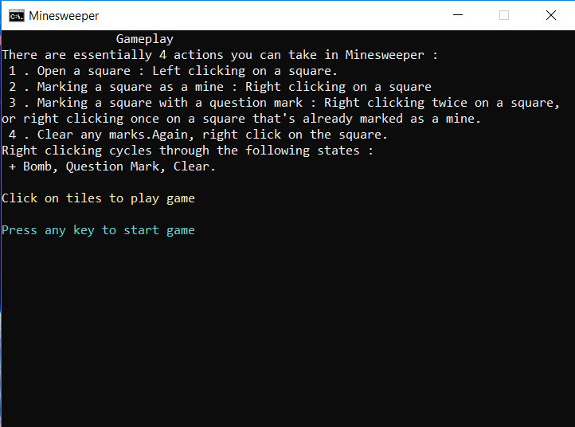
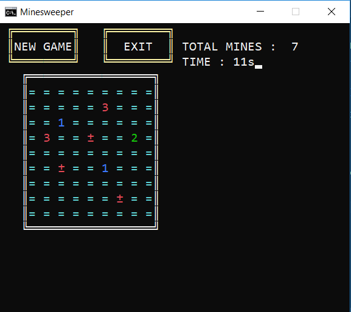
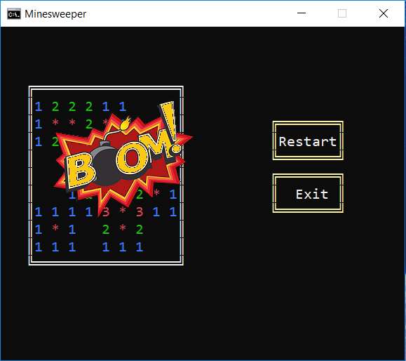
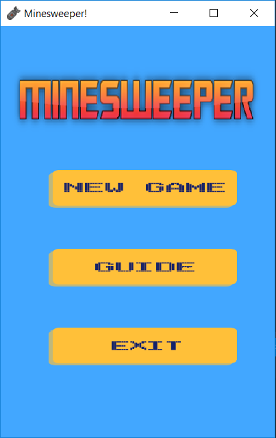
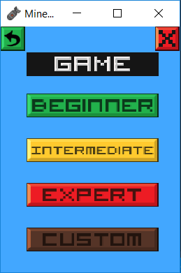
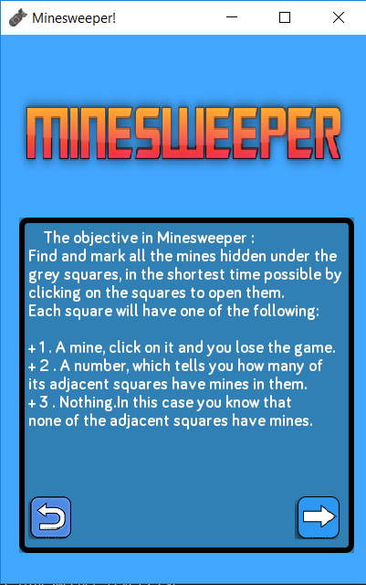
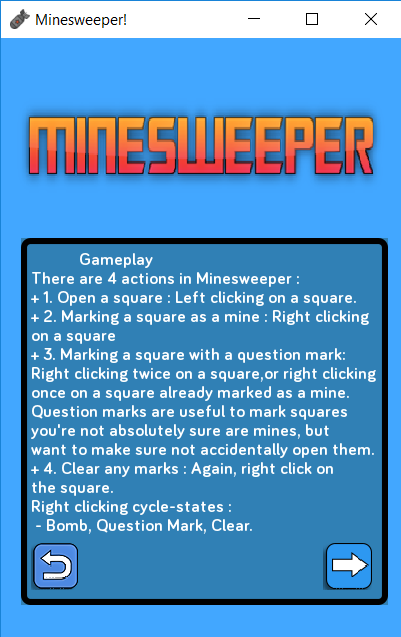
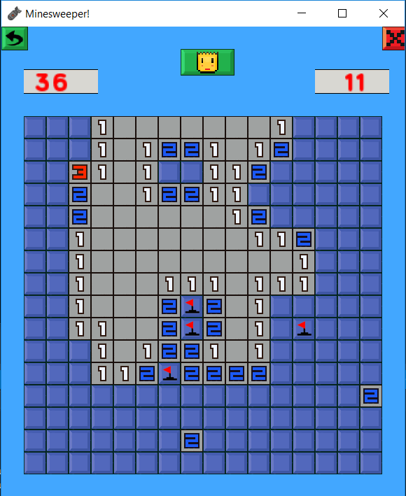

# Minesweeper
Minesweeper Game built with **_WinAPI &amp; SFML Framework_**. 

Game has 5 levels : 
  + Level 1 -> 4 played on console (WinAPI).
  + Level 5 has it own UI (SFML Framework). __(see [screenshots](###Screenshots) below)__

All 5 levels support playing with mouse click.

For fully explatation about this project's requirements, please take a look in file [**_Minesweeper.pdf_**](Minesweeper.pdf).

## Getting Started

### Coding Structures
**1. Main.cpp** : Main loop of the game.

**2. Data.h & Data.cpp** : Handling Game Logic. 

**3. Graphic.h & Graphic.cpp** : Handling Game Graphic & UI.

### Screenshots

  
  
  

  
  
  
   

  

### How to Use
**1. For _level 1 -> level 3_**:
  - Run the EXE file in Release.rar with Command Line.
  - Parameters : **_"LevelX.exe" "X" "input.txt"_** (without double-quote)
  
                `
                X is the level number.
                
                input.txt contains info about mines, numbers,...
                `
                
    ex. **_Level1.exe 1 input.txt_**
    
**2. For _level 4_**:
  - Parameters : **_"Level4.exe" "4" "input.txt" "output.txt"_** (without double-quote)
                
                `
                input.txt contains info about mines, numbers,...
                
                output.txt contains infor about highscores, time played...
                `
                
**3. For _level 5_**:
  - Run the EXE file in Release.rar **directly**.

### Rebuild from sourcecode
**1. For level 1 -> level 4** : Build normally with Visual Studio 2015 and above (otherwise you could copy all the sourcecode and build with your IDE).
Remember to take images along with the build to run it, unless you want to face a program crash.

**2. For level 5** : You must config the project **exactly** as [SFML's Guide](https://www.sfml-dev.org/tutorials/2.5/). 
I have attached the framework's files to this repo, or you can download other version to match your Visual C++ version.

## References

All information about this project's process can be found at my [Trello Board](https://trello.com/b/PTSfLNqW/minesweeper)

Please create new issue if you face any problems/bugs in my code and I will fix it as soon as possible. Thanks for your contribution.
